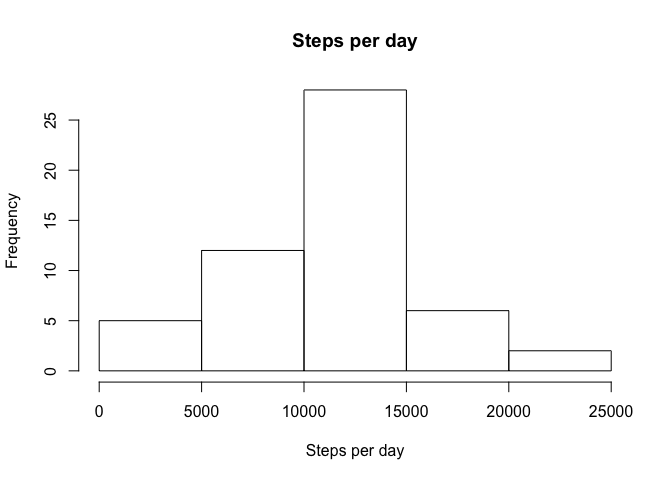
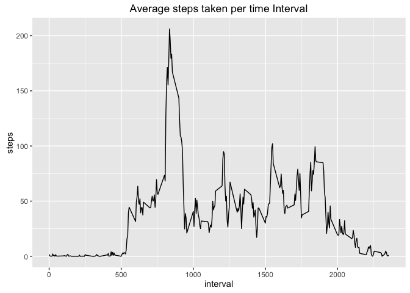
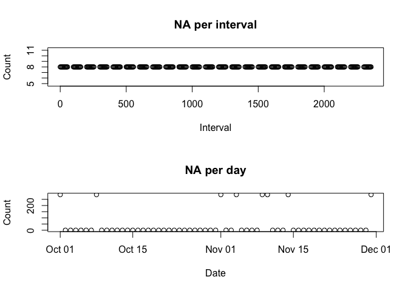
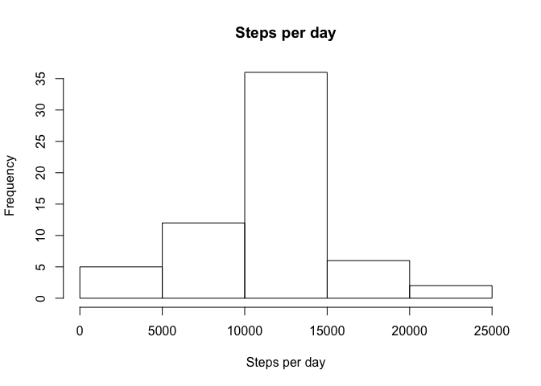
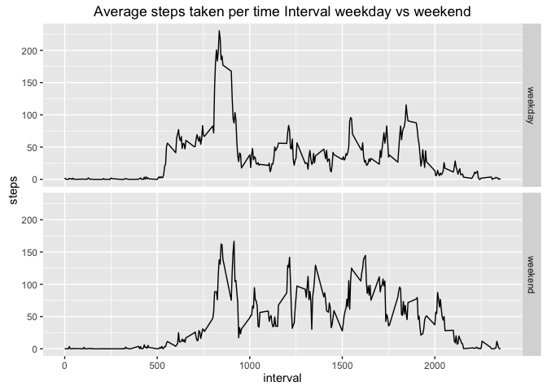

# Reproducible Research: Peer Assessment 1


## Loading and preprocessing the data

```r
#unzip and read in data
unzip("activity.zip")
data <- read.csv("activity.csv")
```

### Raw Data Structure


```r
str(data)
```

```
## 'data.frame':	17568 obs. of  3 variables:
##  $ steps   : int  NA NA NA NA NA NA NA NA NA NA ...
##  $ date    : Factor w/ 61 levels "2012-10-01","2012-10-02",..: 1 1 1 1 1 1 1 1 1 1 ...
##  $ interval: int  0 5 10 15 20 25 30 35 40 45 ...
```


### Raw Data Summary


```r
summary(data)
```

```
##      steps                date          interval     
##  Min.   :  0.00   2012-10-01:  288   Min.   :   0.0  
##  1st Qu.:  0.00   2012-10-02:  288   1st Qu.: 588.8  
##  Median :  0.00   2012-10-03:  288   Median :1177.5  
##  Mean   : 37.38   2012-10-04:  288   Mean   :1177.5  
##  3rd Qu.: 12.00   2012-10-05:  288   3rd Qu.:1766.2  
##  Max.   :806.00   2012-10-06:  288   Max.   :2355.0  
##  NA's   :2304     (Other)   :15840
```


### Convert dates to date objects


```r
data$date <- as.Date(data$date)
```


## What is mean total number of steps taken per day?


```r
sumPerDay <- tapply(data$steps, data$date, sum)

meanPerDay <- mean(sumPerDay, na.rm = TRUE)
# round and convert to a char so that it dosn't print as in exponent form
meanPerDay <- as.character(round(meanPerDay, 2))
medianPerDay <- median(sumPerDay, na.rm = TRUE)

hist(sumPerDay, xlab = "Steps per day", main = "Steps per day")
```

 

The mean number of steps taken per day is **10766.19**  

The median number of steps taken per day is **10765**


## What is the average daily activity pattern?


```r
library(ggplot2)
meanPerInterval <- aggregate(steps ~ interval, data = data, mean, na.rm = TRUE)

g <- ggplot(meanPerInterval, aes(x = interval, y = steps))
g + geom_line() + ylab("steps")  + ggtitle("Average steps taken per time Interval")
```

 

```r
maxInterval <- meanPerInterval[meanPerInterval$steps == max(meanPerInterval$steps),"interval"]
```

The max 5 miniute interval is **835** 


## Imputing missing values


```r
totalNA <- sum(is.na(data$steps))
```

The total number of NA is **2304**. To pick a method to fill in the missing values first we plot the number of NA per interval and per day to see if there are any patterns to inform with replacment stratigy to use.   


```r
naPerInterval <- tapply(data$steps, data$interval, function(x){ sum(is.na(x))} )
naPerDay <- tapply(data$steps, data$date, function(x){ sum(is.na(x))} )

par(mfrow = c(2, 1))
plot(row.names(naPerInterval), naPerInterval,  xlab = "Interval", ylab = "Count", main = "NA per interval")
plot(as.Date(row.names(naPerDay)), naPerDay,  xlab = "Date", ylab = "Count", main = "NA per day")
```

 

```r
par(mfrow = c(1, 1))
```

The plots show that NA exist for full days, i.e. every interval has the same number of NA, and each day that has NA has 288 missing values which is all the intervals. Therefore to replace the NA I will uses the mean value for each interval. 


```r
# replacing NA with mean at each interval
dataWithNAReplaced <- data
for(i in 1:nrow(dataWithNAReplaced)) {
  if(is.na(dataWithNAReplaced[i,"steps"])){
    dataWithNAReplaced[i, "steps"] <- meanPerInterval[meanPerInterval$interval == (dataWithNAReplaced[i, "interval"]), "steps"]
  }
}
```


### Data with NA replaced by means

```r
sumPerDayNoNA <- tapply(dataWithNAReplaced$steps, dataWithNAReplaced$date, sum)
meanPerDayNoNA <- mean(sumPerDayNoNA)
# round and convert to a char so that it dosn't print as in exponent form
meanPerDayNoNA <- as.character(round(meanPerDayNoNA, 2))
medianPerDayNoNA <- median(sumPerDayNoNA)
# round and convert to a char so that it dosn't print as in exponent form
medianPerDayNoNA <- as.character(round(medianPerDayNoNA, 2))
                                 
hist(sumPerDayNoNA, xlab = "Steps per day", main = "Steps per day")
```

 

The mean number of steps taken per day with the NA replaced is **10766.19** the origianl value when NA are ignored is 10766.19. These values are the same which is expected as the NA replacment was effectivly adding the mean day for each day that was missing. 

The median number of steps taken per day with the NA replaced is **10766.19** the origianl value when NA are ignored is 10765

Using the means per interval has had little impact on the histogram or mean/mediam. 


## Are there differences in activity patterns between weekdays and weekends?

```r
library(ggplot2)
dataWithNAReplaced$dayType <- as.factor(ifelse(weekdays(dataWithNAReplaced$date) == "Sunday" | weekdays(dataWithNAReplaced$date) == "Saturday", "weekend", "weekday" ))

averagesPerIntervalDayType <- aggregate(steps ~ interval + dayType, data = dataWithNAReplaced, mean)

g <- ggplot(averagesPerIntervalDayType, aes(x = interval, y = steps))
g + facet_grid(dayType ~ .) + geom_line() + ylab("steps")  + ggtitle("Average steps taken per time Interval weekday vs weekend")
```

 

